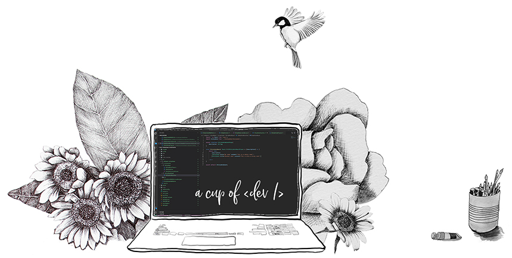

## Hi there

I’m so glad that you found my little corner of the internet, or the GitHub corner at least (I also have a blog, see below for more information about that).

So, who am I you might ask? Well, I'm Eli, mother of two beautiful girls, wife to a handsome man, and also - a front end developer. Which is why I'm here og GitHub. I live just south of Oslo, Norway, and I currently work as a consultant at [Point Taken AS](https://pointtaken.no/).

I mostly work in the Microsoft 365-sphere, and I have been since 2013 (or the SharePoint-sphere before M365 was a thing). So my set of skills are fairly specialiced around that. Luckily the platform has evolved during the last few years so M365 development are now similar to any other web development. I'm most happy if I get to play around with React and create cool stuff - and make it look nice. 

What I love most about being a concultant is that you never know what the next project will brung. And I recently joined 'Team Web' at [nho.no](https://nho.no) where I get to play with episerver and some vue.js. So really - nothing I'm familiar with. So a lot of learning going on - which I love. (Luckily - since working as a developer is almost like being a life time student.)

## Blog - A cup of dev
As a developer I read a lot of blogs. And in my experience I can read multiple different blogposts about exatcly the same topic, and only one of them makes sense to me. Therefore I’m adding my voice to the mix, and hopefully one of my blogposts will be the one that makes sense of a topic for you. 

You can find my blog on  [acupof.dev](https://acupof.dev)

